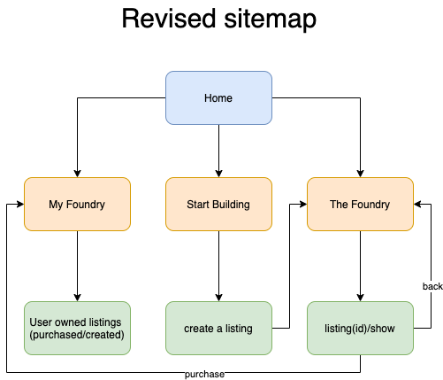
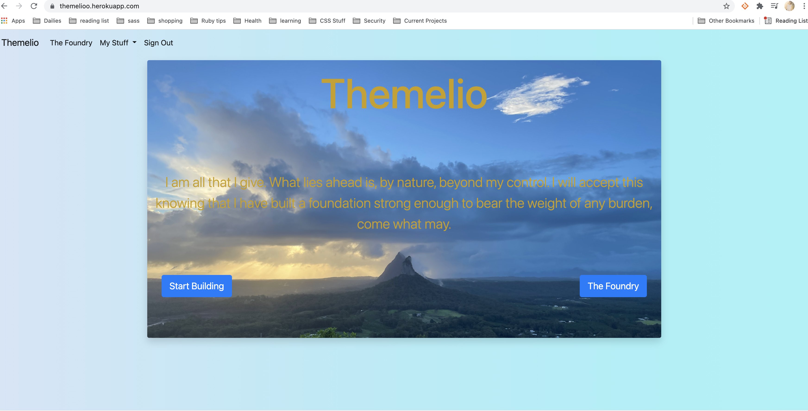
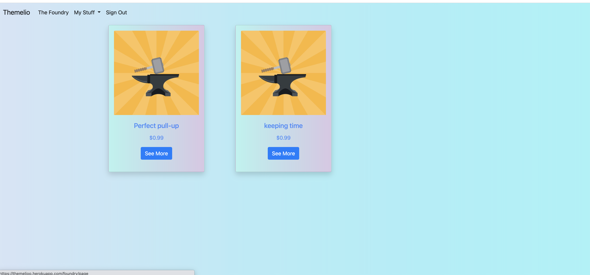
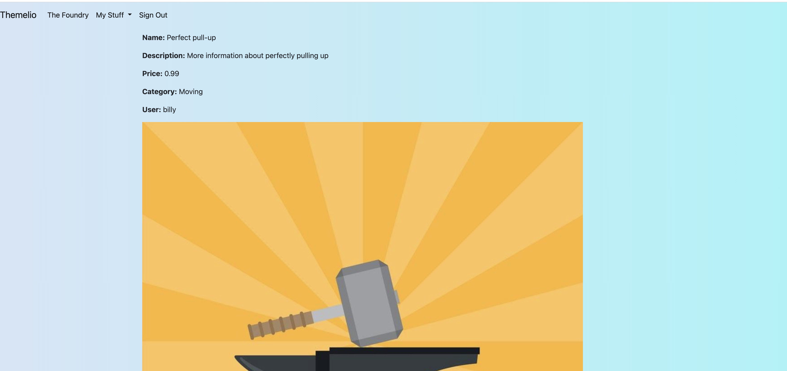
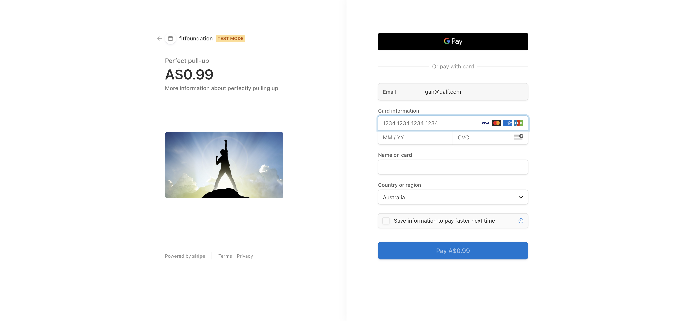
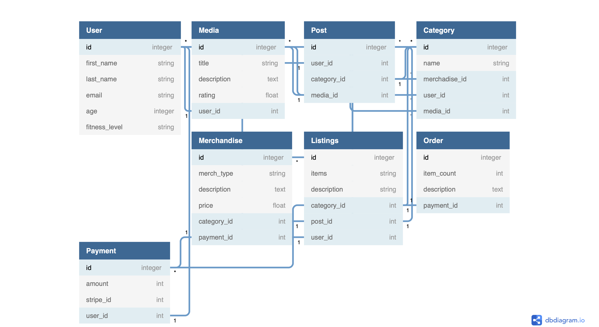
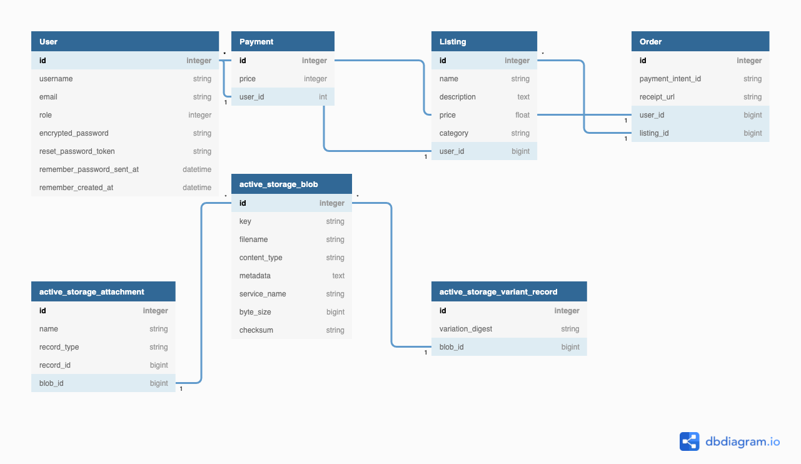

# T2A2 Marketplace Project - FitFoundation

## Problem To Be Solved
- In the fitness sphere of the internet community there is a preponderance of services that guide new learners down paths that lead to bad habits, personal-image-shaming, and ultimately failure of the goal to make health and fitness a part of ones' life. This issue is compounded by investors pushing products through leaders of the community who are paid to support them without necessarily believing in them. These products, regardless of their efficacy, are seen by acolytes and initiates as panaceas to their personal problems. As more individuals seek to adopt healthy lifestyles this duplicity is leading to a lack of faith in the pursuit of health and causing newcomers to believe that vanity is more important than well-being. 
- To further elaborate on this problem it can be broken down into two constituent parts:
    1. Personal
        - Too often is it the case that beginners find themselves being incredibly critical of their own abilities as well as their image. It stands to reason that as a result, if someone wants to change their health, they must first be willing to adjust the system of judgement that they use to analyze their own life. 
    2. Extra-Personal
        - Beyond personal barriers, the second most significant threat to successfully bettering ones' health and well-being is interaction with others. Humans often rely on experts in fields that they have little-to-no practice in to guide them in a safe and sound direction. Unfortunately, this is not the case in the health and fitness industry. Often, professionals who have put in the time to gain status in the community use that status to sell products that had very little bearing on their own ability to attain a high health status. This misleading can very often cause beginners to give up, believing that they have some intrinsic flaw that is holding them back when they can't attain the "immediate" results that these industry professionals tout so highly. 
        - Comparison of phsyical form, also falling into the Extra-Personal category, can be very damaging to a beginner's mentality. Many professionals in industry fail to make it known that they have spent almost a lifetime attaining the form they have. This misleading must be addressed early on in the journey of a beginner or run the risk of tainting their understanding of how beautiful their own form is. 
--- 

## Why Solve This Problem? 
- Overall health and well-being are critical to the maintainence of a thriving life in the developed communities around planet earth today. It is easy for an individual to overlook or not place emphasis on these two facets of life when they are obfuscated by the obligations that most working adults face. However, a moderate and healthy focus on these two aspects of being lead to healthier humans who both live longer and are more productive members of the societies within which they exist. It is critical that, in the wake of a rapid expansion thanks to sensationalism on the part of the internet and influencers, regular humans develop a healthy relationship with health. Teaching them to focus on what works for them and what makes them feel best regardless of the influence of dubious products and sellers who seek to confuse attainment of health with attainment of wealth for themselves at the cost of those who they train. 
- ### How does this application serve this purpose?
    - da
--- 

## Website Link
- [Themelio](https://themelioo.herokuapp.com/)
--- 

## Github Repository Link
 - [github](https://github.com/Ausiarm/T2A2-_Marketplace_Project)
---

## General description
- Purpose: 
    - To provide an self-image-friendly and health-encouraging platform for users with little-to-no experience in the world of fitness. 
- Functionality / features
    - Home page
        - Simple and non-confusing page featuring:
            - Logo.
            - The basic philosophy of the platform in no more than three sentences.
            - Buttons for logging in as well as signing up.
                - *Update_Post_deployment: This feature was modified. Main buttons are now for creation of guides as well as heading straight to the foundry. all other interactivity was moved to the navbar for purposes of simplicity.*
    - Foundry
        - The landing page of the platform
            - Scrollable feed.
            - Features 2-3 images coupled with descriptions per row.
            - Each entity has the ability to be rated by the user (referred to in app as builders).
                - *Update_Post_deployment: For the sake of time this feature was not addressed, would like to add at a later date.* 
            - Clicking an entity takes the user to a page that features its full description as well as the ability to purchase that content for a flat fee, do so will add the content to the Builder's MyFoundry.
                - *Update_Post_deployment: This feature was modified into a see more button to reduce potential confusion.*
    - My Foundry
        - The "profile" page for each builder.
        - features basic information about the builder:
            - name
            - date of birth
            - goals 
            - picture
        - Foreign Materials:
            - Section that shows any content that the builder has either liked or purchased. 
        - Domestic Goods:
            - Section that allows for uploading of personal content that can be featured on the Foundry landing page.
        - *Update_Post_deployment: This page was updated and modified for the sake of time, all it will display currently are the user's purchased guides.*
    - Merchandise
        - Storefront that will sell merchandise related to the fitfoundation brand for the purposes of donating to charity and/or fitness related support groups.
            - *Update_Post_deployment: this feature will be added at a later time as it was more of a nice to have addition and less of a critical part of the application.*
    - Help/FAQ's
        - Page dedicated to questions that are frequently asked.
            - Scrollable feed of commonly asked questions.
            - Box at the bottom to post a question that has not already been asked.
        - *Update_Post_deployment: this feature will be deployed at a later time.* 
- Sitemap
    - 
    - *This version of the sitemap reflects changes made to the application during development. It became necessary to revise and simplify when time began to run down for submittal.*
- Screenshots
    - 
        - Note the lack of clutter on the home page. The idea here was to remain as minimal as possible with the intention of scaling and scope increase in the future.
    - 
        - On the foundry page all listings can be seen that have been created on the application. From here a user can choose to click into the see more function and purchase a listing.
    - 
        - Once a user has clicked on see more they are directed to a page that will show the details of the listing and give the user a better preview before a buy. 
    - 
        - After choosing to purchase a listing the user can find all listings that have been purchased on their my foundry page.
    - 
        - Evidence of appropriate stripe incorporation. 
    
- Target audience
    - People with little-to-no experience with fitness who are afraid to try to become healthier due to how daunting the goal seems from afar.
- Tech stack (e.g. html, css, deployment platform, etc)
    - HTML 
        - Utilized for basic type entry and structuring of views. Along with embedded ruby this forms the main foundation of the application from a user presentation point of view.
    - CSS
        - After development of main features from a logic standing, CSS was incorporated to add some pop and interest to the basic page views.
    - Ruby on Rails
        - Language used for devlopment of application.
    - Javascript
        - While still unfamiliar with javascript it was necessary to incorporate for use in the stripe payment integration process. 
    - Heroku
        - Service used to deploy site live. 
    - Amazon 
        - Utilized Amazon S3 for storage of images
    - Ultrahook
        - Utilized in conjunction with stripe to capture payment information and store in databases as well as presenting to the user. 
---

## User Stories
1. Beginner with no experience:
    - As a beginner with no background in fitness, I want access to a trustable source of health training so that I can become healthy and fit in a positive and sustainable manner.
2.  User with moderate experience:
    - As a person who has a moderate amount of exercise and health knowledge, I want access to learning from members of the community with a focus on healthy habits so that I can broaden my scope and diversify my understanding of health. 
3.	Trainer interested in training others:
    - As a trainer, I want to help the fitness community by posting easy to understand information so that beginners can use it to grow their health toolset. 
4.	Expert interested in sourcing different ideas to exercise:
    - As an expert in fitness, I want to be aware of the current trends in fitness and of how the fitness community is evolving so that I can keep up to date in my own practice.
5.	User interested in purchasing merchandise:
    - As a member of the general public I want access to merchandise that represents a positive brand so that I can spread awareness of that brand. 
---

## Wireframes
- 
    - These served as a platform to narrow down the scope of the project, they have been left unmodified as the ultimate goal of the project is to get to the point where it reflects the wireframe design. 
---

## ERD
- 
    - Above is the original ERD created for this project in the conceptual phase. Please note the differences between it and the revised version posted below. These revisions represent the need for consolidation of tasks in order to meet project deadlines. In addition, the first iteration of the ERD assumed far too much complexity on the part of the application's models and it was necessary to reel this in when actually devloping the application itself. 
- 
---

## Explain the different high-level components (abstractions) in your app
---

## Detail any third party services that your app will use
- Heroku
- Amazon
- Stripe
- Ultrahook 
---

## Describe your projects models in terms of the relationships (active record associations) they have with each other
--- 

## Discuss the database relations to be implemented in your application
---

## Provide your database schema design (Ask teej what this is??)
- plan ERD
- discuss the relations of the ERD
--- 

## Describe the way tasks are allocated and tracked in your project
--- 