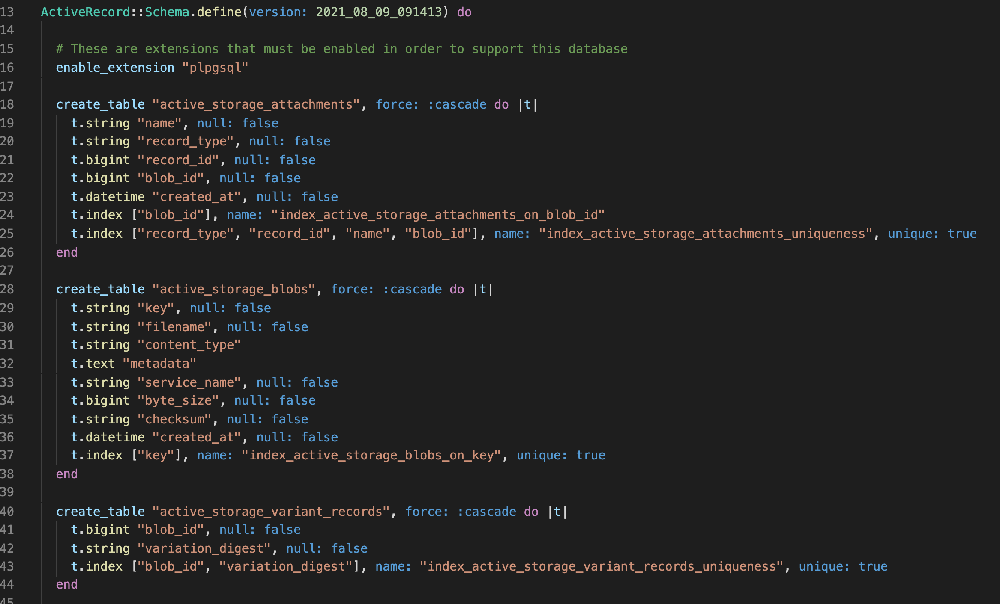
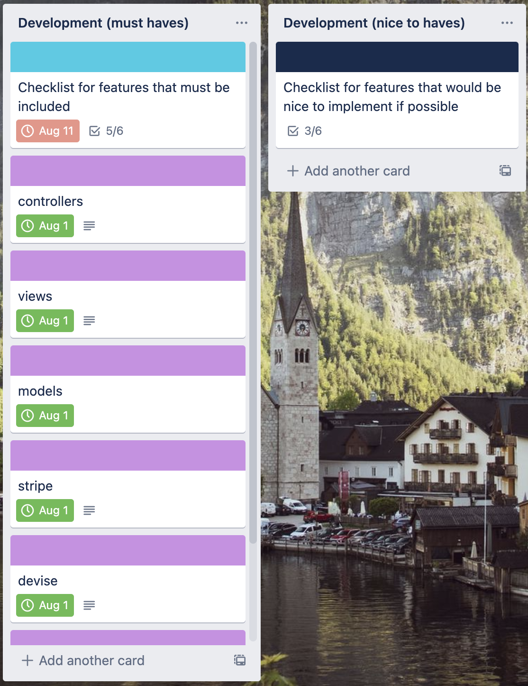

# T2A2 Marketplace Project - Themelio


## Problem To Be Solved
- In the fitness sphere of the internet community there is a preponderance of services that guide new learners down paths that lead to bad habits, personal-image-shaming, and ultimately failure of the goal to make health and fitness a part of ones' life. This issue is compounded by investors pushing products through leaders of the community who are paid to support them without necessarily believing in them. These products, regardless of their efficacy, are seen by acolytes and initiates as panaceas to their personal problems. As more individuals seek to adopt healthy lifestyles this duplicity is leading to a lack of faith in the pursuit of health and causing newcomers to believe that vanity is more important than well-being. 
- To further elaborate on this problem, it can be broken down into two constituent parts:
    1. Personal
        - Too often is it the case that beginners find themselves being incredibly critical of their own abilities as well as their image. It stands to reason that as a result, if someone wants to change their health, they must first be willing to adjust the system of judgement that they use to analyze their own life. 
    2. Extra-Personal
        - Beyond personal barriers, the second most significant threat to successfully bettering ones' health and well-being is interaction with others. Humans often rely on experts in fields that they have little-to-no practice in to guide them in a safe and sound direction. Unfortunately, this is not the case in the health and fitness industry. Often, professionals who have put in the time to gain status in the community use that status to sell products that had very little bearing on their own ability to attain a high health status. This misleading can very often cause beginners to give up, believing that they have some intrinsic flaw that is holding them back when they can't attain the "immediate" results that these industry professionals tout so highly. 
        - Comparison of physical form, also falling into the Extra-Personal category, can be very damaging to a beginner's mentality. Many professionals in industry fail to make it known that they have spent almost a lifetime attaining the form they have. This misleading must be addressed early in the journey of a beginner or run the risk of tainting their understanding of how beautiful their own form is. 
--- 

## Why Solve This Problem? 
- Overall health and well-being are critical to the maintenance of a thriving life in the developed communities around planet earth today. It is easy for an individual to overlook or not place emphasis on these two facets of life when they are obfuscated by the obligations that most working adults face. However, a moderate and healthy focus on these two aspects of being lead to healthier humans who both live longer and are more productive members of the societies within which they exist. It is critical that, in the wake of a rapid expansion thanks to sensationalism on the part of the internet and influencers, regular humans develop a healthy relationship with health. Teaching them to focus on what works for them and what makes them feel best regardless of the influence of dubious products and sellers who seek to confuse attainment of health with attainment of wealth for themselves at the cost of those who they train. 
    - ### How does this application serve this purpose?
        - Themelio will provide users a no-frills experience that will isolate them from the paid abuse of their trust that typically occurs in the health and fitness industry.
            - The site will not take funds from companies in industry to push products on their users nor will it endorse certain methodologies over others. It is simply a platform that will allow users to search for guides that seem interesting to them. Later, after initial MVP release, functionality will be built into the application to allow users to reach out to one another. This will allow for collaboration in the event that a user really appreciates a point of view from a guide and wants to learn more from the person who created the listing that houses the guide.  
--- 

## Website Link
- [Themelio](https://themelioo.herokuapp.com/)
--- 

## Github Repository Link
 - [github](https://github.com/Ausiarm/T2A2-_Marketplace_Project)
---

## General description
- Purpose: 
    - To provide an self-image-friendly and health-encouraging platform for users with little-to-no experience in the world of fitness. 
- Functionality / features
    - Home page
        - Simple and non-confusing page featuring:
            - Logo.
            - The basic philosophy of the platform in no more than three sentences.
            - Buttons for logging in as well as signing up.
                - *Update_Post_deployment: This feature was modified. Main buttons are now for creation of guides as well as heading straight to the foundry. all other interactivity was moved to the navbar for purposes of simplicity.*
    - Foundry
        - The landing page of the platform
            - Scrollable feed.
            - Features 2-3 images coupled with descriptions per row.
            - Each entity has the ability to be rated by the user (referred to in app as builders).
                - *Update_Post_deployment: For the sake of time this feature was not addressed, would like to add at a later date.* 
            - Clicking an entity takes the user to a page that features its full description as well as the ability to purchase that content for a flat fee, do so will add the content to the Builder's MyFoundry.
                - *Update_Post_deployment: This feature was modified into a see more button to reduce potential confusion.*
    - My Foundry
        - The "profile" page for each builder.
        - features basic information about the builder:
            - name
            - date of birth
            - goals 
            - picture
        - Foreign Materials:
            - Section that shows any content that the builder has either liked or purchased. 
        - Domestic Goods:
            - Section that allows for uploading of personal content that can be featured on the Foundry landing page.
        - *Update_Post_deployment: This page was updated and modified for the sake of time, all it will display currently are the user's purchased guides.*
    - Merchandise
        - Storefront that will sell merchandise related to the fitfoundation brand for the purposes of donating to charity and/or fitness related support groups.
            - *Update_Post_deployment: this feature will be added at a later time as it was more of a nice to have addition and less of a critical part of the application.*
    - Help/FAQ's
        - Page dedicated to questions that are frequently asked.
            - Scrollable feed of commonly asked questions.
            - Box at the bottom to post a question that has not already been asked.
        - *Update_Post_deployment: this feature will be deployed at a later time.* 
- Sitemap
    - 
    - *This version of the sitemap reflects changes made to the application during development. It became necessary to revise and simplify when time began to run down for submittal.*
- Screenshots
    - 
        - Note the lack of clutter on the home page. The idea here was to remain as minimal as possible with the intention of scaling and scope increase in the future.
    - 
        - On the foundry page all listings can be seen that have been created on the application. From here a user can choose to click into the see more function and purchase a listing.
    - 
        - Once a user has clicked on see more they are directed to a page that will show the details of the listing and give the user a better preview before a buy. 
    - 
        - After choosing to purchase a listing the user can find all listings that have been purchased on their my foundry page.
    - 
        - Evidence of appropriate stripe incorporation. 
    
- Target audience
    - People with little-to-no experience with fitness who are afraid to try to become healthier due to how daunting the goal seems from afar.
- Tech stack (e.g. html, css, deployment platform, etc)
    - HTML 
        - Utilized for basic type entry and structuring of views. Along with embedded ruby this forms the main foundation of the application from a user presentation point of view.
    - CSS
        - After development of main features from a logic standing, CSS was incorporated to add some pop and interest to the basic page views.
    - Ruby on Rails
        - Language used for development of application. While it is he case that some JavaScript was incorporated, the bulk of the application was built on ruby. 
    - JavaScript
        - While still unfamiliar with javascript it was necessary to incorporate for use in the stripe payment integration process. 
    - Heroku
        - Service used to deploy site live. 
    - Amazon 
        - Utilized Amazon S3 for storage of images
    - Ultrahook
        - Utilized in conjunction with stripe to capture payment information and store in databases as well as presenting to the user through a webhook method in the payments controller. 
    - PostgreSQL
        - The database to be used when building the application. In order to specify postgreSQL of regular SQL in rails the command ```rails new (appname) -d postgresql``` must be entered into terminal when creating the application. This tells rails to utilize postgreSQL instead.
---

## User Stories
1. Beginner with no experience:
    - As a beginner with no background in fitness, I want access to a trustable source of health training so that I can become healthy and fit in a positive and sustainable manner.
2.  User with moderate experience:
    - As a person who has a moderate amount of exercise and health knowledge, I want access to learning from members of the community with a focus on healthy habits so that I can broaden my scope and diversify my understanding of health. 
3.	Trainer interested in training others:
    - As a trainer, I want to help the fitness community by posting easy to understand information so that beginners can use it to grow their health toolset. 
4.	Expert interested in sourcing different ideas to exercise:
    - As an expert in fitness, I want to be aware of the current trends in fitness and of how the fitness community is evolving so that I can keep up to date in my own practice.
5.	User interested in purchasing merchandise:
    - As a member of the general public, I want access to merchandise that represents a positive brand so that I can spread awareness of that brand. 
---

## Wireframes
- 
    - These served as a platform to narrow down the scope of the project, they have been left unmodified as the ultimate goal of the project is to get to the point where it reflects the wireframe design. They can be further broken down into desktop, tablet, and mobile views:
        - Desktop
            - 
            - Note that the desktop version has the highest level of complexity, which is admittedly still quite low.
            - The decision was made to have plain text instead of a logo in this release version of the application. Later on this will be updated with a visually pleasing and indentifiable logo. 
        - Tablet 
            - 
            - Similar to desktop view with some minor modifications to play into tablet maneuverability.
        - Mobile
            - 
            - The simplest view possible, designed to be finger-scrollable and clickable before anything else by enlarging views and focusing on single guides at a time.
    - Other than the specific differences noted above under the respective views, please pay attention to the idea behind the design. Keeping with the format of designing for the base level user, which in this case is a person who has little-to-no understanding of fitness, this app remains simple across all platforms. It is not intended that the user suffer from inundation of information. The idea is that this is a simple and easy place to come to find guides on how to grow. Whether that is done through mobile, tablet, or desktop view is up to the user. 
---

## ERD
- 
    - Above is the original ERD created for this project in the conceptual phase. Please note the differences between it and the revised version posted below:
        - Removed media, post, category, and merchandise tables
            - These tables proved to be too complex to involve in the scope that they were originally intended. Media and its contents were an overcomplication in the planning phase that could be better dealt with through use of Amazon S3. Post proved to be redundant as it was another way of referencing a listing. Category could be more easily included into the listings table as an enumerable to reduce overall complexity. Finally, merchandise works as a table and is a valuabale inclusion but lacks purpose currently as the merchandise logic and views were not able to be implemented in time. 
        - These revisions being made, the relationships of entities in the database are much clearer to see and can be added to in the future without having to plan the whole ERD structure over again. 
    - These revisions represent the need for consolidation of tasks in order to meet project deadlines. In addition, the first iteration of the ERD assumed far too much complexity on the part of the application's models and it was necessary to reel this in when actually developing the application itself. 
- 
---

## High-Level Components
- How does MVC work in this app?
    - Keeping with standards of the MVC (Model, View, and Controller) protocol, this app stores data and logic within the models set up for each of the individual sections. These models are: 
        - Listing
        - Order
        - Payment
        - User
        - 
    - In order to interact with or change these models in any way, methods are provided in each of their corresponding controllers that allow admins to CRUD (create read update destroy) the database. These controllers are:
        - Foundry 
        - Home
        - Listings
        - Orders
        - Payments 
        - Restricted
        - 
    - Finally, once a method is called that is set up in the controller, this method routes to a specific view that has been set up in order to display the pertinent information based off user request. These views are:
        - Devise
        - Foundry
        - Home
        - Layouts
        - Listings
        - Orders
        - Payments 
        - Restricted 
        - Shared
        - 
- What does user interaction look like with routes?
    - The MVC pattern works in conjunction with the config/routes.rb file. Here an application is given instructions on where to send users based off their interaction with the views of the application. The reason that these routes work in conjunction with the MVC pattern mentioned above is that they also reference the specific method names created in the corresponding controller in order to send users to the correct pages based off what links or actions they are interacting with. An example of how routes fit in to the MVC pattern is noted below. Additionally, please reference the attached photo to understand what is meant by saying that routes reference specific method names. 
        - 
- To better explain these high-level components of the app, an example follows using the Listing MVC:
    - A user navigates to the home page of the app (structure laid out above in sitemap previously posted in section 5) and from here has the option to go to The Foundry. Once they click on this button the server will send a GET request from the browser that is configured in the routes.rb section of this application. this GET request will cause the server to append the end of the url with the ```/listings``` suffix. Now that this route has been correctly added to the link, the applications MVC pattern takes over. The ```/index``` method that is in the listings controller will be invoked. When this is done the controller will communicate with the model to access the listings database. Once this communication occurs the controller will subsequently communicate with the appropriate view (if adhering to ruby best practices, this view will be located in the listings folder in views and be called index.html.erb). When named correctly, rails will know that the index method in the listings controller is meant to function in conjunction with the index view specifically created in that listings folder. The controller will essentially assess the structure of the views page and use it to populate the new webpage that the user has navigated to. In this case (as can be seen below) the index.html.erb view dictates that a loop shall run, creating a card style presentation for each of the listings in the database. What the user will see is rendered visual representation of the data from the listings database and from here they can navigate to see more or go back to the home page. 
        - 

---

## Third Party Services
- Heroku
    - An online hosting service that has a range of packages for everyone from students up to enterprise businesses. Based off the needs of the project, a user may choose to opt for any one of heroku's possible options for deployment. In addition to offering hosting services, heroku has a quick and easy guide in their documentation that will help and first timer quickly understand how to deploy a development project to a live state. Used for live deployment due to ease of access as well as ability to deploy for free while under a certain amount of data usage.
- Amazon S3
    - Amazon's cloud storage for images/media proved to be very helpful for storing uploaded photos outside of the application so that load times would not become extraneous in the event of high traffic and usage of the site. 
- Stripe
    - Stripe's easy to integrate functionality, along with its free use proved to be the perfect tool for implementing a payment service. Additionally, it allows for much safer interaction with user's private payment information that could potentially be handled poorly in the event that an application was attempting to store it on the back-end. Through interaction with the api key provided by Stripe website can access the sensitive information that is passed through Stripe in order to present a purchaser with appropriate information while also being sure to have that information guarded with high levels of encryption. 
- Ultrahook 
    - Ultrahook served as the free service that allowed for the creation of a webhook that would catch user information and route it to the server when specified for a checkout.session.completed instance. By doing this the application could effectively integrate with Stripe and be able to process user receipts as well as allowing payments to be properly processed.
- Github
    - Github served for version control throughout the process of developing the app. As is the case with all other projects, version control proved critical when the application broke and changes were impossible to rectify. 
- Trello
    - Trello provided the platform for monitoring daily effectiveness in task completion as well as creating a proper schedule that led to on time delivery of the project.
- PostgreSQl
    - Ruby on Rails, the language that this app was developed in, normally uses SQL or SQL lite. However, for this project it was required to make use of postgreSQL for the database. 
- Diagrams.net
    - This service, while not directly included in the app, was helpful for creation of a succinct and easy to understand ERD as well as sitemap. 
- Devise
    - Devise is a gem available to the public for incorporation into ruby applications. It comes with a built-in suite of services that extend far beyond the scope of this application. For the purposes that it was used here, devise managed all user authentication and helped to create the views necessary for a user to create and subsequently log in to a unique account that is bound to them alone. 
- Simple form
    - Simpleform is a gem available to the public for incorporation into ruby applications. In conjunction with other gems, simpleform can be used to create seamless and easy to incoporate forms into a web application. In this app it was used to create the layout of the devise views that a user will interact with when signing up, creating a listing, and destroying one. 
- Pundit
    - Pundit is a gem available to the public for incorporation into ruby applications. Pundit makes it easy to create and manage policies that govern the access or authorization of users throughout the application. For the purposes of this app pundit was incorporated to control who has administrative positions. Anyone labled admin under the pundit policy may access and edit any listing while standard users may only edit their own listings. 
- Bootstrap
    - Bootstrap is a gem available to the public for incorporation into ruby applications. A one stop shop for anything style related in a ruby on rails app. Bootstrap was used to create each of the views that a user sees when interacting with this application. Through bootstrap all listings are able to presented to potential purchasers as cards. Along with this, a jumbotron display was utilized in order to present the home page in a simple and clean manner. The bootstrap library has countless modifications that can be utilized to change the styling of a webpage and will be used moving forward with later iterations of the website. 
---

## Model Relationships
- For the sake of being able to deliver a working MVP (minimum viable product), the models of this project associate with one another through one-to-many interactions. 
    - What is a one-to-many interaction? 
        - What the one-to-many status on a model indicates is that one entity from a model may have or create many entities that exist within another model and maintain ownership of those entities. This is best demonstrated with the user model from this application in relation to the listings model. Note the pictures of the models below:
        - 
        - 
        - Note the ```has_many :listings``` code at the top of the user model and the ```belongs_to :user``` at the top of the listing model. These two snippets of code create the one-to-many relationship referenced above. With this relationship in place, a user can create as many listings as they like. Each of those listings will be added to the database with a specific identifier (a foreign key) that establishes which user created them. Specifically, one user, as this relationship is a one-to-many relationship.
- Outside of the user and listing model used to explain the relationship they share; this application has an order and a payment model as well. Both of these models belong to the user model in the same one-to-many style of relationship while order has another one-to-many relationship that binds it to listing as well. This is important as it makes clear that for an order to actually be processed, it must be bound to a listing. 
--- 

## Database Relations
- This application makes use of one kind of relation: One-to-many. Briefly touched on in the section above, more specifc information follows about the description of a one-to-many relationship. 
    - This type of relationship is often utilized whenever there is a need to house information about entities that can create an unlimited number of entities that are then able to be accessed by other users. In other words, a one-to-many relationship is one in which an entity in one table (which can be referred to as the parent entity) can reference multiple entities of another table (known as the child entity). Why is this important? Imagine if instead of a one-to-many, the user and listing tables had a one-to-one relationship. In this scenario a user would only be able to create a single listing and after this they would no longer have the ability to create more without creating another unqiue identity (a whole different user profile). In order to denote a one-to-many relationship in a database ERD, specific graphical representation is necessary. While there are a few different options one can resort to, the one chosen for this application utilizes the built in functionality of ERD's created on [diagrams.net](https://app.diagrams.net/). This application represents this relationship by connecting two entities with a line. At one end it can be seen that there is a 1, indicating the entity in the relationship that is unique and represent the "one" in one-to-many. At the other end an asterisk can be seen. This indicates the "many" part of the one-to-many relationship. In the example below this is demonstrated with user and listing.
        - 
    - [Source](https://www.techopedia.com/definition/25122/one-to-many-relationship) 
---

## Database Schema Design
- Schema photos for evidential reference:
    - 
    - 
    - 
- The photos above lay out the Schema for the database. This file, located in app/db is the repository for all the tables that are included in the database. An application administrator can make changes to the database (and subsequently the schema file) through use of migrations that are generated in rails. It is best practice to never modify the schema file itself as utilizing migrations allows for the reversal of changes if need be. In essence, a migration is a modification that is made to a table in order to change or add entity-bearing columns or other features to it. 
- It can be observed that along with the models mentioned above(listing, user, order, and payment), the schema file also includes a few active storage tables as well. These tables are automatically rendered for the user when creating a rails project in conjunction with scaffolding. To make these changes to the schema one must enter ```rails db:migrate``` after creation of the project. This command will run through all migrations in the migration folder and commit any changes to the schema file that need to be made that have yet to be committed.
- A user can observe migrations in the same location as the schema file and one that was used to add ```username``` to the user model can be seen below. 
    - 
- In the migration pictured above, please note the add_column line. This is an active record method that allows the user to write ruby code that the rails console can convert into SQL language that will then modify the postgreSQL database that houses the data for this application. In addition to what was stated above, once this migration is created by running ```rails g migration AddUsernameToUser``` all the user needs to do is run ```rails db:migrate``` and the changes will be added to the database and the schema file will be updated. In the case of this specific example one would expect to see username as a column in the user table within the schema file. Sure enough, and pictured below, this change has been made in the schema file. 
    - 
<br>

- The goal for this project was to aim high and reduce complexity in the building process. Keeping with this the schema file for this release version of Themelio has a limited number of tables that, though limited, serve the purposes of providing this MVP with the basic structural database it needs in order to run. In the future more tables will be added to house the data required to add more functionality to user interaction as well as accrediting different users through means such as liking/rating reviews.
--- 

## Task Allocation and Tracking
- Trello was used in order to accurately track progress as well as breaking down the assignment into manageable portions of work. This resource can be accessed free of charge by navigating to trello.com and signing up for an account. Once a project page has been created it can be populated with tasks and set up in the manner that best suits the project planner. This assignment was broken down into 4 sections on trello:
- 
    - Documentation
        - This section of the trello board was critical for laying out which portions of the documentation could be completed before the projects commencement and which would need to be saved until completion. 
        - It was further split into three sections and included checkable boxes that allowed for constant monitoring of which tasks remained to be completed.
        - See documentation photos for examples of the above:
            - 
                - Here is where tasks that could be immediately completed were recorded.
            - 
                - Here is the location that allowed for keeping track of how documentation was being progressed through.
            - 
                - Here is where all remaining and not-yet-completed documentation tasks were stored
    - User stories
        - In this section the user stories that were implemented to handle planning scope and purpose of the application were stored. Through constant reference to these cards it was possible to develop an application that kept true to its overall purpose and scope rather than deviating during development. Note that the beginner user story is the main focus of attention for this iteration of the application. 
            - 
            - 
    - Development
        - Here is where all development tasks were stored, much like the documentation section above, this column was broken down into levels of completion. This staggering of completeness allowed for constant movement through tasks without not knowing what to work on after completion of a single job. In addition, this section included timed due dates on objects in order to properly pace out the project and be sure to have enough time to revise documentation after development. 
            - 
            - Note that there was a nice to have section included here. This column served as a reminder of what can be added at a future date and to show that the project isn't over simply because it has been turned in. 
    - Presentation
        - Lastly, due to the need to compartmentalize this project to handle time management, the presentations section was left until the end. This approach allowed for the presentation to not only demonstrate the product but also reflect the challenges incurred to get to the product rather than showing off a concept without any real object to point to. 
            - 
--- 